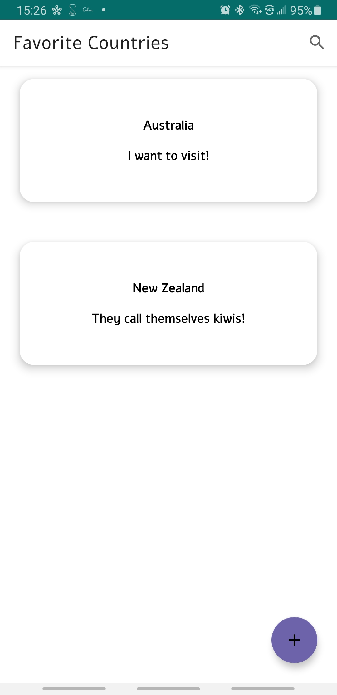
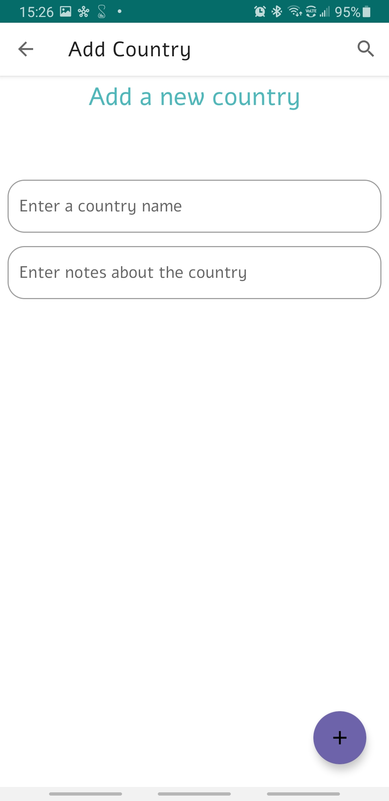
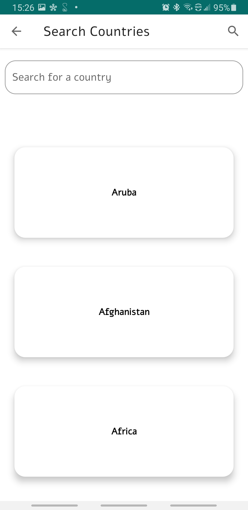
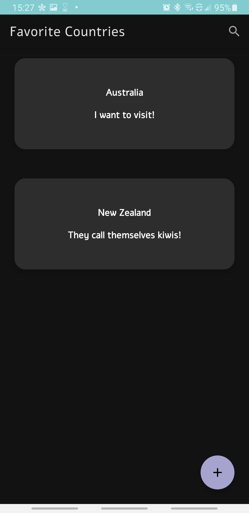
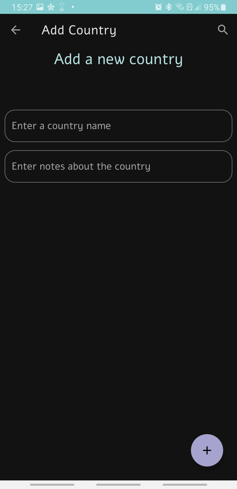
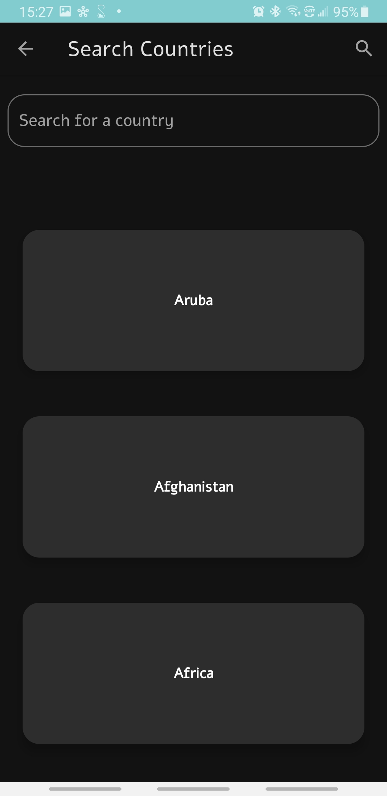

# 🌐 Favorite Countries (Native Android app built with Kotlin)

Android app to keep track of your favorite countries and what you like about them
* ✅ Search for countries 
* ✅ Add your own places
* ✅ Persistant, local storage (Offline support)
* ✅ Keep track of your favorite countries and notes about them
* ✅ Delete favorite countries
* ✅ Dynamic theme support (Automatically switches between light and dark mode based on device setting)

## 🕹 Features
- Uses Android Architecture components, including LiveData, ViewModel, Navigation, and ViewBinding to make the app robust, stable, and maintainable
- Follows Google's recommended single activity architecture and MVVM design pattern
- Uses Material Design components for a beautiful, consistent design

## 🖥 Technologies used

<b>Built with</b>
- Android SDK
- Kotlin
- [ViewModel](https://developer.android.com/topic/libraries/architecture/viewmodel)
- [LiveData](https://developer.android.com/topic/libraries/architecture/livedata)
- [Room](https://developer.android.com/topic/libraries/architecture/room)
- [View Binding](https://developer.android.com/topic/libraries/view-binding)
- [Navigation Component](https://developer.android.com/guide/navigation)- [Firebase Authentication](https://firebase.google.com/docs/auth)
- [Material Design](https://material.io/)

## 📚 Libraries used

* [Multi View Adatper](https://devahamed.github.io/MultiViewAdapter/#/)

## 👨🏻‍💻 Developed By
[Ashton Jones](https://www.ashtonjones.dev/) 

👨‍💻 Google Certified Android Engineer |
✍ Writer |
🧘‍♂️ Stoic && Meditator
👨🏻‍💻 Ashton Jones
📩 ashtonjonesdev@gmail.com
🌐 www.ashtonjones.dev

Copyright 2020 Ashton Jones

## 📸 Screenshots
&ensp;&ensp;&ensp;
------
&ensp;&ensp;&ensp;
